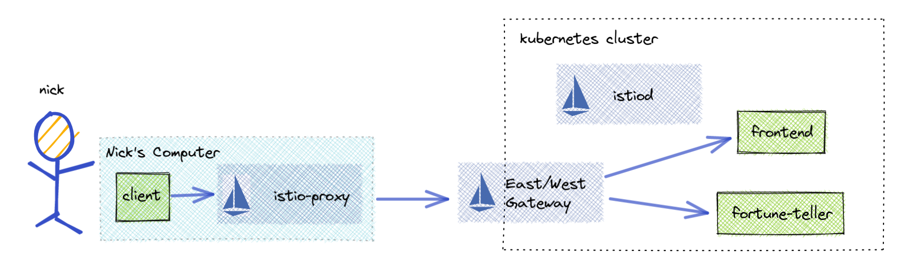
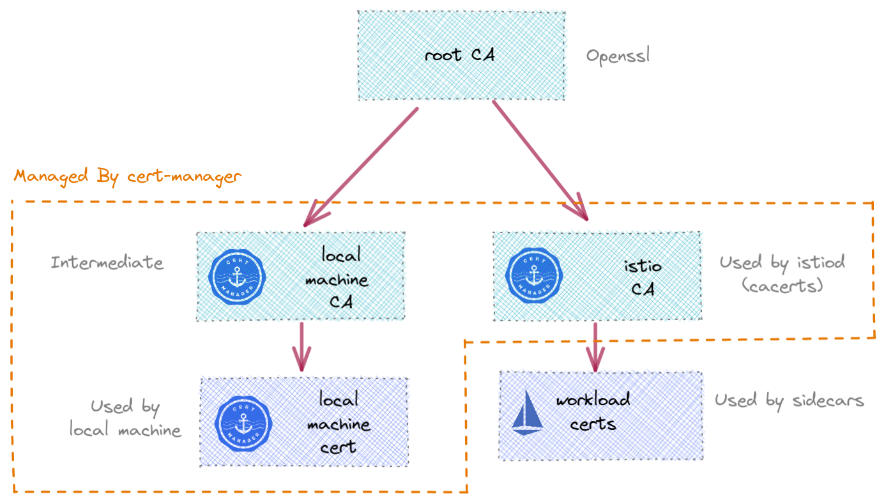
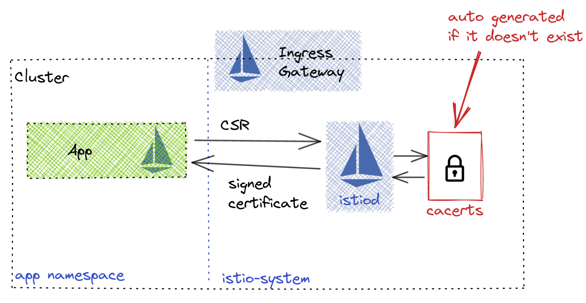
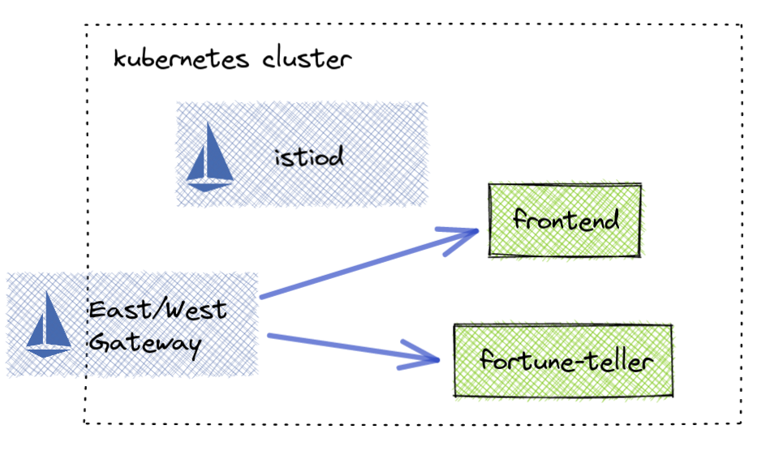
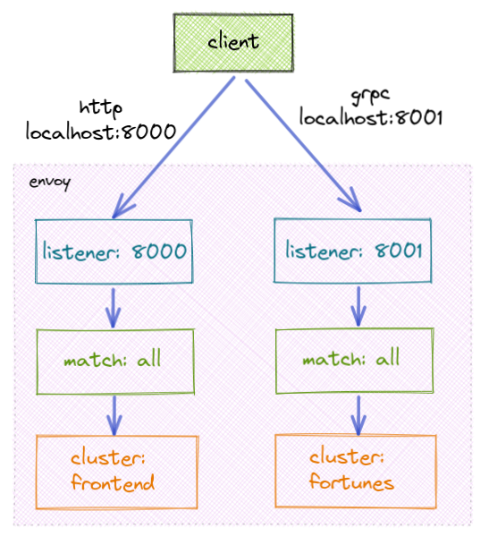
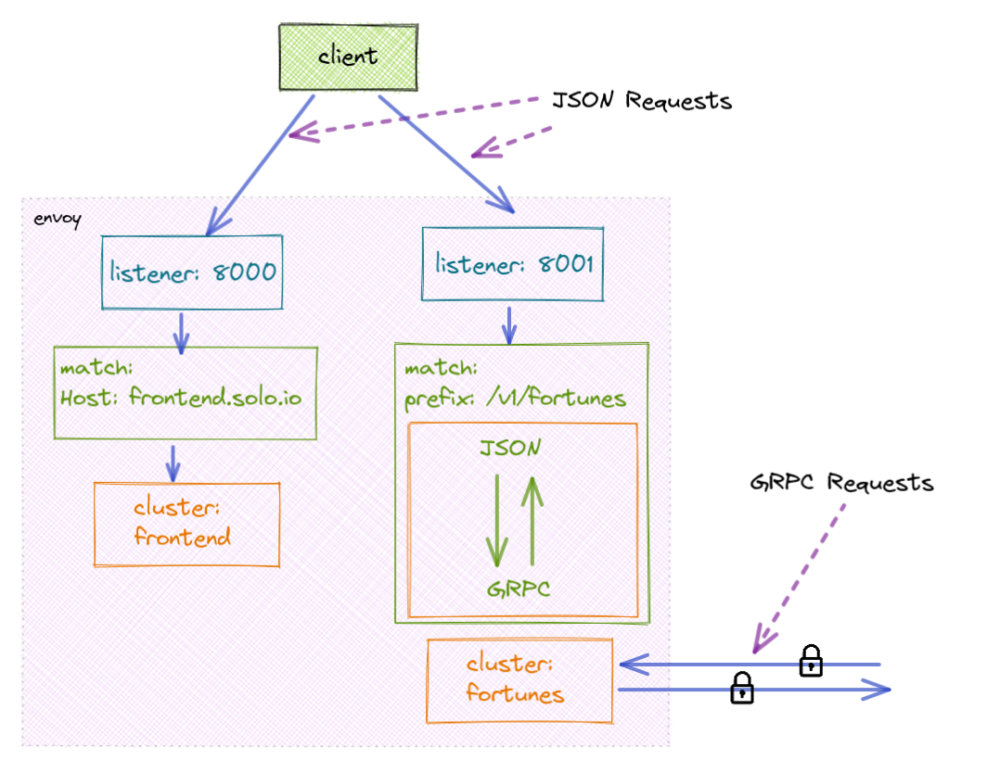

# Istiocon 2022 - Join locally, learn globally



## Kubernetes Cluster
If you need to setup a kubernetes cluster you can use the below configuration in Google Cloud to get one. 
```sh
gcloud container clusters create "istiocon-2022-demo" \
  --project="$GCP_PROJECT" \
  --cluster-version="1.21.9-gke.1002" \
  --zone="$GCP_ZONE" \
  --machine-type="e2-standard-2" \
  --num-nodes="2" \
  --no-enable-legacy-authorization
```

## Certificates



1. Generate `root-ca`  and copt to kubernetes from the `1-certificates` folder

```sh
mkdir ./certs
openssl req -new -newkey rsa:4096 -x509 -sha256 \
        -days 3650 -nodes -out ./certs/root-ca.crt -keyout ./certs/root-ca.key \
        -config 1-certificates/root-ca.conf

kubectl create namespace cert-manager
kubectl create secret generic root-ca \
  --from-file=tls.key=./certs/root-ca.key \
  --from-file=tls.crt=./certs/root-ca.crt \
  --namespace cert-manager
```

2. Install cert-manager

```sh
kubectl apply -f https://github.com/cert-manager/cert-manager/releases/download/v1.8.0/cert-manager.yaml

# wait for cert manager pods
kubectl wait --for=condition=ready pod -l app=cert-manager -n cert-manager
kubectl wait --for=condition=ready pod -l app=webhook -n cert-manager
```

3. Load `root-ca` into cert-manager

```sh
kubectl apply -f- <<EOF
apiVersion: cert-manager.io/v1
kind: Issuer
metadata:
  name: root-ca
  namespace: cert-manager
spec:
  ca:
    secretName: root-ca
EOF
```

4. Create an intermedate for Istio and our local machines
```sh
kubectl apply -f- <<EOF
apiVersion: cert-manager.io/v1
kind: Certificate
metadata:
  name: istio-cacerts
  namespace: cert-manager
spec:
  secretName: istio-cacerts
  duration: 720h # 30d
  renewBefore: 360h # 15d
  commonName: istio.solo.io
  isCA: true
  usages:
    - digital signature
    - key encipherment
    - cert sign
  dnsNames:
    - istio.solo.io
  # Issuer references are always required.
  issuerRef:
    kind: Issuer
    name: root-ca
---
apiVersion: cert-manager.io/v1
kind: Certificate
metadata:
  name: local-machine-cacerts
  namespace: cert-manager
spec:
  secretName: local-machine-cacerts
  duration: 720h # 30d
  renewBefore: 360h # 15d
  commonName: local-machines.solo.io
  isCA: true
  usages:
    - digital signature
    - key encipherment
    - cert sign
  dnsNames:
    - local-machines.solo.io
  # Issuer references are always required.
  issuerRef:
    kind: Issuer
    name: root-ca
---
# Create an issuer from the local-machine-ca
apiVersion: cert-manager.io/v1
kind: Issuer
metadata:
  name: local-machine-ca
  namespace: cert-manager
spec:
  ca:
    secretName: local-machine-cacerts
EOF
```




5. Copy istio-cacerts to `istio-system`

>since cert-manager secrets are not compatible with Istio currently we need to reconstruct the secret by downloading the secret and creating a new one in istio-system

```sh
mkdir ./certs

# download the secret in the istio format
kubectl get secret istio-cacerts -n cert-manager -o json | jq '.data."tls.crt"' -r | base64 --decode > ./certs/ca-cert.pem
kubectl get secret istio-cacerts -n cert-manager -o json | jq '.data."tls.key"' -r | base64 --decode > ./certs/ca-key.pem
kubectl get secret istio-cacerts -n cert-manager -o json | jq '.data."ca.crt"' -r | base64 --decode > ./certs/root-cert.pem
kubectl get secret istio-cacerts -n cert-manager -o json | jq '.data."tls.crt"' -r | base64 --decode > ./certs/cert-chain.pem
kubectl get secret istio-cacerts -n cert-manager -o json | jq '.data."ca.crt"' -r | base64 --decode >> ./certs/cert-chain.pem


kubectl create namespace istio-system
# create the istio secrets from the download files
kubectl create secret generic cacerts -n istio-system \
      --from-file=./certs/ca-cert.pem \
      --from-file=./certs/ca-key.pem \
      --from-file=./certs/root-cert.pem \
      --from-file=./certs/cert-chain.pem
```

6. Generate our local machine certificate using cert-manager
```sh
kubectl apply -f- <<EOF
apiVersion: cert-manager.io/v1
kind: Certificate
metadata:
  name: local-machine-istio-proxy
  namespace: cert-manager
spec:
  secretName: local-machine-istio-proxy
  duration: 720h # 30d
  renewBefore: 360h # 15d
  commonName: envoy-proxy
  isCA: false
  usages:
    - client auth
  uris:
    - spiffe://local-machines.solo.io/ns/local-machines/sa/nicks-local-machine
  # Issuer references are always required.
  issuerRef:
    kind: Issuer
    name: local-machine-ca
EOF
```

7. Download the local-machine certificate

```sh
kubectl get secret local-machine-istio-proxy -n cert-manager -o json | jq '.data."tls.crt"' -r | base64 --decode > ./certs/local-machine-cert.pem
kubectl get secret local-machine-istio-proxy -n cert-manager -o json | jq '.data."tls.key"' -r | base64 --decode > ./certs/local-machine-key.pem
kubectl get secret local-machine-istio-proxy -n cert-manager -o json | jq '.data."ca.crt"' -r | base64 --decode > ./certs/local-machine-ca-cert.pem
```


## Install Istio and Applications


1. Sync the Istio Helm repositories

```sh
helm repo add istio https://istio-release.storage.googleapis.com/charts
helm repo update
```

2. Install Istio Core (CRDs, istiod)
```sh
# Install Istio CRDS
helm install istio-base istio/base \
  --namespace istio-system \
  --version 1.12.6

# Install istiod
# Since we are using separate intermedates we do not want to validate the trust domain
helm install istiod istio/istiod \
  --set pilot.env.PILOT_SKIP_VALIDATE_TRUST_DOMAIN='true' \
  --set meshConfig.accessLogFile='/dev/stdout' \
  --namespace istio-system \
  --version 1.12.6
```

3. Install Applications
```sh
kubectl create namespace istiocon
kubectl label namespace istiocon istio-injection=enabled
# http application
kubectl apply -n istiocon -f 2-istio-deployment/apps/frontend.yaml
# grpc application
kubectl apply -n istiocon -f 2-istio-deployment/apps/fortune.yaml
```


## Istio Configuration for Local Machine



1. Deploy the eastwest gateway

```sh
tee 2-istio-deployment/eastwest-gateway-values.yaml << EOF
name: istio-eastwestgateway
labels:
  istio: eastwestgateway
service:
  ports:
  - name: tls
    port: 15443
    targetPort: 15443
env:
  ISTIO_META_ROUTER_MODE: "sni-dnat"
EOF


helm install istio-eastwestgateway istio/gateway \
  -f 2-istio-deployment/eastwest-gateway-values.yaml \
  --namespace istio-system \
  --version 1.12.6

```

2. Create Gateway resource for port 15443
```sh
kubectl apply -f- <<EOF
apiVersion: networking.istio.io/v1alpha3
kind: Gateway
metadata:
  name: eastwest-gateway
  namespace: istio-system
spec:
  selector:
    istio: eastwestgateway
  servers:
    - port:
        number: 15443
        name: tls
        protocol: TLS
      tls:
        mode: AUTO_PASSTHROUGH
      hosts:
        - '*istiocon.svc.cluster.local'
        - '*solo.io'
EOF
```

3. Add ServiceEntries for the applications
```
kubectl apply -f 2-istio-deployment/service-entries.yaml
```


* Inspect the gateway listeners

```sh
POD_NAME=$(kubectl get pods --namespace istio-system -l "app=istio-eastwestgateway" -o jsonpath="{.items[0].metadata.name}")

istioctl proxy-config listeners $POD_NAME -n istio-system

```

* Print SNI Matchers
```sh
POD_NAME=$(kubectl get pods --namespace istio-system -l "app=istio-eastwestgateway" -o jsonpath="{.items[0].metadata.name}") 

istioctl proxy-config listeners $POD_NAME -n istio-system -o json | jq '.[].filterChains[].filterChainMatch.serverNames'
```


```sh
[
  "outbound_.50051_._.fortune-teller.istiocon.svc.cluster.local"
]
[
  "outbound_.8080_._.frontend.istiocon.svc.cluster.local"
]
[
  "outbound_.50051_._.fortunes.solo.io"
]
[
  "outbound_.8080_._.frontend.solo.io"
]
```


* Example TCP Passthough Listener (Condensed)

```sh
POD_NAME=$(kubectl get pods --namespace istio-system -l "app=istio-eastwestgateway" -o jsonpath="{.items[0].metadata.name}") 

istioctl proxy-config listeners $POD_NAME -n istio-system -o yaml --address frontend.solo.io | less
```

```yaml
  - filterChainMatch:
      applicationProtocols:
      - istio
      - istio-peer-exchange
      - istio-http/1.0
      - istio-http/1.1
      - istio-h2
      serverNames:
      - outbound_.8080_._.frontend.solo.io
    - name: envoy.filters.network.tcp_proxy
      typedConfig:
        '@type': type.googleapis.com/envoy.extensions.filters.network.tcp_proxy.v3.TcpProxy
        cluster: outbound_.8080_._.frontend.solo.io
        statPrefix: outbound_.8080_._.frontend.solo.io
  listenerFilters:
  - name: envoy.filters.listener.tls_inspector
    typedConfig:
      '@type': type.googleapis.com/envoy.extensions.filters.listener.tls_inspector.v3.TlsInspector
  name: 0.0.0.0_15443
  trafficDirection: OUTBOUND

```

## Local Machine Setup


### Envoy Configuration



* Listener - Define the port istio-proxy should listen to
```yaml
static_resources:
  listeners:
  - address:
    # listen for traffic on port 8000
      socket_address:
        address: 0.0.0.0
        port_value: 8000
    filter_chains:
...
```

* Routes - match on traffic and route to a "Cluster"
```yaml
    filter_chains:
    - filters:
      - name: envoy.filters.network.http_connection_manager
        typed_config:
          '@type': type.googleapis.com/envoy.extensions.filters.network.http_connection_manager.v3.HttpConnectionManager
          ...
          route_config:
            name: local_route
            virtual_hosts:
            - name: routes
              domains:
              - "*"
              routes:
                # Route /frontend http requests to frontend cluster
              - match:
                  prefix: "/"
                route:
                  cluster: frontend
          http_filters:
          - name: envoy.filters.http.router
```


* Transformations - manipulate the traffic 
```yaml
...
          http_filters:
          # Enable grpc/json transcoding for the build.stack.fortune.FortuneTeller service
          - name: envoy.filters.http.grpc_json_transcoder
            # https://www.envoyproxy.io/docs/envoy/latest/api-v3/extensions/filters/http/grpc_json_transcoder/v3/transcoder.proto#extensions-filters-http-grpc-json-transcoder-v3-grpcjsontranscoder
            typed_config:
              "@type": type.googleapis.com/envoy.extensions.filters.http.grpc_json_transcoder.v3.GrpcJsonTranscoder
              proto_descriptor: "/etc/config/fortune.pb"
              services: ["build.stack.fortune.FortuneTeller"]
              print_options:
                add_whitespace: true
                always_print_primitive_fields: true
                always_print_enums_as_ints: false
                preserve_proto_field_names: false
              convert_grpc_status: true
          - name: envoy.filters.http.router
```

* Clusters - connection setting for upstream service
```yaml
  clusters:
  - name: frontend
    type: STRICT_DNS
    lb_policy: ROUND_ROBIN
    connect_timeout: 10s
    load_assignment:
      cluster_name: frontend
      endpoints:
      - lb_endpoints:
        - endpoint:
            address:
              socket_address:
                # eastwestgateway ip address
                address: 34.86.78.208
                port_value: 15443
    transport_socket:
      name: envoy.transport_sockets.tls
      typed_config:
        "@type": type.googleapis.com/envoy.extensions.transport_sockets.tls.v3.UpstreamTlsContext
        sni: outbound_.8080_._.frontend.solo.io
        common_tls_context:
          alpnProtocols:
          - istio-peer-exchange
          - istio
          tls_certificates:
          - certificate_chain:
              filename: /certs/local-machine-cert.pem
            private_key:
              filename: /certs/local-machine-key.pem
          validation_context:
            trusted_ca:
              filename: /certs/local-machine-ca-cert.pem
```

### Demo

1. Run the HTTP demo
```sh
docker-compose -f docker-compose-http.yaml up
```

2. Call the container on port 8000
```sh
curl -v "http://localhost:8000/info"
```




3. Run the JSON to GRPC demo
```sh
docker-compose -f docker-compose-json-grpc.yaml up
```

4. Call the container on port 8001 using grpc

```sh
grpcurl --plaintext -protoset 3-local-machine/fortune.pb localhost:8001 describe                                  
```

```proto
build.stack.fortune.FortuneTeller is a service:
service FortuneTeller {
  rpc Predict ( .build.stack.fortune.PredictionRequest ) returns ( .build.stack.fortune.PredictionResponse ) {
    option (.google.api.http) = { get:"/v1/fortune/{user_id}"  };
  }
}
```


```sh
grpcurl --plaintext -protoset 3-local-machine/fortune.pb -d '{"user_id": "nick"}' localhost:8001 build.stack.fortune.FortuneTeller/Predict
```


5. same call using REST / JSON
```sh
curl -v "http://localhost:8001/v1/fortune/nick"
```


## Cleanup
```
gcloud container clusters delete "istiocon-2022-demo" --project="$GCP_PROJECT" --zone $GCP_ZONE
```